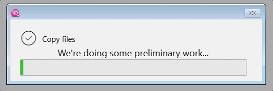

#progress

A simple platform-dependant implementation of a class-driven progress dialog

|macOS|Windows|
|:----:|:----:|
|||

* The dialog box is managed by a worker, which disconnects it strongly from your code and doesn't slow it down. 

* You can set a delay during which progress will not be displayed. In this way, the progress dialog will only be displayed if the processing time exceeds the time you have set.

* Generic icons are provided for your convenience, but you can of course use any you like.

### Sample code

```4d
var $progress : cs.progress
$progress:=cs.progress.new()
$progress.title:="Copy files"
$progress.icon:="check"
$progress.message:="We're doing something..."

// Do something

$progress.Close()
```

📌 See the [class documentation](Documentation/Classes/progress.md) that describe properties & functions.

📌 Don't forget to open and run the **HDI_xxx** methods, where the commented code teaches you all the possibilities.

> * [HDI_progress](./Project/Sources/Methods/HDI_progress.4dm)
> * [HDI_delay](./Project/Sources/Methods/HDI_delay.4dm)
> * [HDI_forEach](./Project/Sources/Methods/HDI_forEach.4dm)

----

I strongly encourage you to enrich this project through pull request. This can only benefit the [4D developer community](https://discuss.4d.com/search?q=4D%20for%20iOS). 

`Enjoy the 4th dimension`

----

**Credits**: Provided icons were published by [IconPai](https://thenounproject.com/iconpai19/) under the [Creative Commons Attribution License (CC BY 3.0)](https://creativecommons.org/licenses/by/3.0/)
